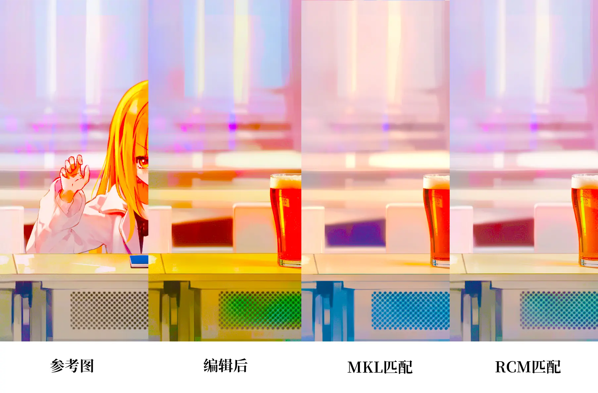

# 【RCM】色色匹配算法！

我最近在玩用扩散模型做图像编辑，用的模型是FLUX.2-klein，但是图像编辑后总是有色差，太坏了！

大家遇到这种情况，会用图像颜色匹配算法把颜色矫正回来吗？

传统颜色匹配算法能解决1些，但仍然会有问题，假如编辑的幅度比较大时<sub>(比如删除了面积大的物体)</sub>，它们就不能很好地匹配颜色，会留下色差。

好在聪明的莉沫酱发明了1个新的颜色匹配算法，这样1来就可以完美地匹配颜色了！


## 原理

原理非常简单，有2个假设:

- 图像匹配是为了找到1个线性变换<sub>(这不1定对，但1般是够用的)</sub>，使变换后的图像img_a尽可能接近图像img_b。

- 图像接近的标准是它们完全相同的像素数尽可能多。

那么这个问题就变成了，找到1个3×3的矩阵W和1个3×1的矩阵B，看起来总共只有12个参数！

所以实现就是1个很简单的搜索算法，用单位矩阵初始化W，用零矩阵初始化B，然后不断对W和B加1个很小的扰动，如果两个图像更接近了，就把W和B更新为扰动后的W和B。

然后是这个算法为什么好。在图像编辑时，假如我把前景换掉了，由于是逐像素做匹配的，所以无论用什么样的线性变换，被替换的部分都几乎不可能被匹配上，这意味着被替换的部分对奖励的贡献始终是0，因此自然就能完全地遵循剩下的部分了。


## 速度

这个算法收敛不是肯定最快的，不过速度的话还算可以。

在默认配置下做了一些测试:

|           | 4060Ti | 4090 |
|:---|---:|---:|
| 没装triton |  10秒  |  2.5秒 | 
| 有装triton |  1.2秒 |  0.7秒 |  

因为这个代码里有实现2个高度优化的triton算子，所以如果你有安装triton的话，推理就会变得非常快！


## 看看效果



从做到右分别是参考图、FLUX.2-klein编辑后的图、编辑后再用MKL匹配回来、编辑后再用RCM匹配回来<sub>(为了明显，我在贴之前用PS把对比度拉大了)</sub>。

可以看出来确实有比MKL好，MKL匹配后背景会发黄，RCM的颜色就很正常。这个大概是因为我是黄头发的，然后Flux把我编辑掉了，MKL就以为要补1些黄色的东西回来吧。


## 使用方法

你需要1个Python，然后这样用pip安装——

```sh
pip install git+https://github.com/RimoChan/rimo_color_match.git
```

安装好以后就可以`import rimo_color_match`啦。

接口是这样的:

```python
def 匹配颜色(img_a: torch.Tensor, img_b: torch.Tensor, 搜索次数=2000, d=0.01, size=128, seed=1, batch_size=512, use_triton='auto'):
    ...
```

- `img_a`和`img_b`两个输入图像都是3维的`torch.Tensor`，值的范围是`0~1`，形状是`h, w, c`格式。
- `搜索次数`就是搜索次数。
- `d`是扰动的强度，1般不要去改它。
- `size`是会把图像resize到这个大小再做匹配，越小匹配越快。
- `seed`是随机种子，对，这显然是1个随机算法。
- `batch_size`是每次扰动时会在多少个不同的扰动中选出最好的那1个。
- `use_triton`指定是否要使用triton，默认行为是如果能import的话就会用。

返回值有3个: 

- 第1个是返回的图片，是`Tensor`，和输入图片的尺寸相同。
- 剩下2个是W和B，1般情况下没有什么用，不过可以用它们做1些高级的操作，比如视频首尾帧生成时用第1帧做匹配，然后用W和B把整个视频都做完颜色匹配。


## ComfyUI使用

这个仓库里也附带了1个ComfyUI的Node，可以直接下载回去用！

操作方法是这样:

- 在ComfyUI的Python环境里执行上面的`pip install`。
- 把这个仓库clone回去，把`ComfyUI-RimoColorMatch`文件夹放进`custom_nodes`就可以了。

不过这样安装是没有triton的，需要自己手动安装，因为大家的torch版本不1样所以没有办法写requirements。

如果是windows用户，也可以装这个[triton-windows](https://github.com/triton-lang/triton-windows)，如果装不来的话，那不装也可以，慢1点也不是不能用！


## 结束

就这样，大家88，我要回去基因编辑猫娘了！
